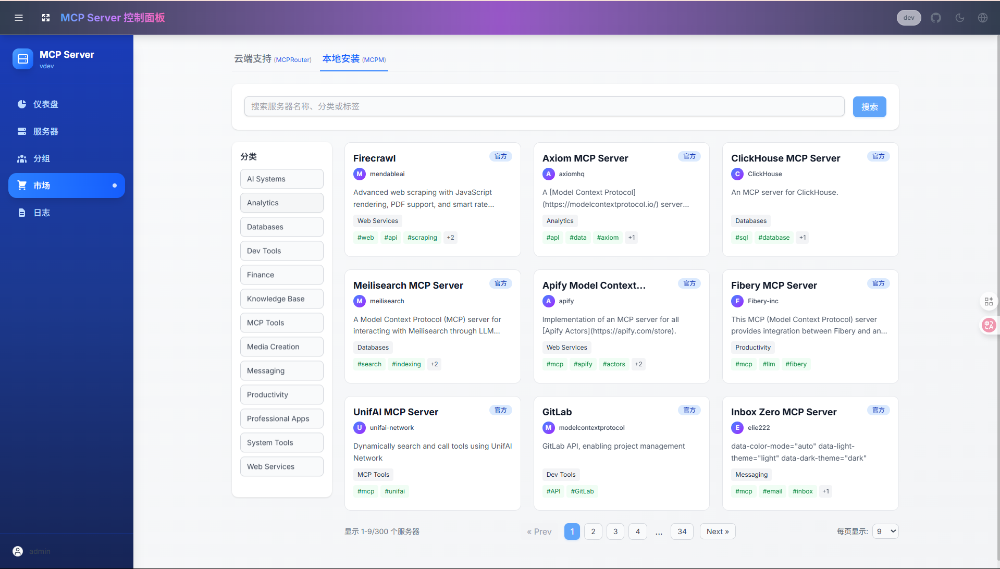

# MCP Server Dashboard: Unified Management Platform for MCP Servers

English | [中文版](README.zh.md)

MCP Server Dashboard simplifies the management and scaling of multiple MCP (Model Context Protocol) servers by organizing them into flexible streaming HTTP (SSE) endpoints. It supports on-demand access to all servers, individual servers, or logically grouped server collections.



## 🚀 Key Features

- **Comprehensive MCP Server Support**: Seamlessly integrate any MCP server with minimal configuration requirements.
- **Centralized Management Console**: Monitor real-time status and performance metrics of all servers from one elegant Web UI.
- **Flexible Protocol Compatibility**: Full support for both stdio and SSE MCP protocols.
- **Hot-Swappable Configuration**: Dynamically add, remove, or update server configurations at runtime without downtime.
- **Group-Based Access Control**: Organize servers with custom groups and manage access permissions.
- **Secure Authentication System**: Built-in user management with role-based access control powered by JWT and bcrypt.
- **Docker-Ready Deployment**: Containerized images provided for rapid deployment.

## 🔧 Quick Start

### Configuration

Customize your server settings by creating a `mcp_settings.json` file:

```json
{
  "mcpServers": {
    "amap": {
      "command": "npx",
      "args": ["-y", "@amap/amap-maps-mcp-server"],
      "env": {
        "AMAP_MAPS_API_KEY": "your-api-key"
      }
    },
    "playwright": {
      "command": "npx",
      "args": ["@playwright/mcp@latest", "--headless"]
    },
    "fetch": {
      "command": "uvx",
      "args": ["mcp-server-fetch"]
    },
    "slack": {
      "command": "npx",
      "args": ["-y", "@modelcontextprotocol/server-slack"],
      "env": {
        "SLACK_BOT_TOKEN": "your-bot-token",
        "SLACK_TEAM_ID": "your-team-id"
      }
    }
  }
}
```

### Docker Deployment

**Quick Start with Docker Compose**:

```bash
# Clone the repository
git clone https://github.com/zxerai/MCP-Server.git
cd MCP-Server

# Start with default configuration
docker-compose up -d

# Or start with Nginx reverse proxy
docker-compose --profile nginx up -d

# Full stack deployment (with Redis & PostgreSQL)
docker-compose --profile nginx --profile redis --profile postgres up -d
```

**Manual Docker Run**:

Mount your custom configuration (recommended):

```bash
docker run -p 3000:3000 -v ./mcp_settings.json:/app/mcp_settings.json -v ./data:/app/data mcpserver:1.0.0
```

Or run with default settings:

```bash
docker run -p 3000:3000 mcpserver:1.0.0
```

### Access the Management Console

Open `http://localhost:3000` and log in with your credentials.

> **Note**: Default credentials are `admin` / `admin123`.

**Console Features**:

- Real-time monitoring of all MCP server status
- Enable/disable or reconfigure servers
- Group management for organizing server access
- User management for access control

### Streaming HTTP Endpoints

> Note: Support for streaming HTTP endpoints varies across different AI clients. If you encounter issues, you can use the SSE endpoints or wait for future updates.

Connect AI clients (e.g., Claude Desktop, Cursor, DeepChat, etc.) via:

```
http://localhost:3000/mcp
```

This endpoint provides a unified streaming HTTP interface for all your MCP servers, allowing you to:

- Send requests to any configured MCP server
- Receive real-time responses
- Easily integrate with various AI clients and tools
- Use the same endpoint for all servers, simplifying your integration process

**Smart Routing (Experimental)**:

Smart Routing is the MCP Server Dashboard's intelligent tool discovery system that uses vector semantic search to automatically find the most relevant tools for any given task.

```
http://localhost:3000/mcp/$smart
```

**How it Works:**

1. **Tool Indexing**: All MCP tools are automatically converted to vector embeddings and stored in PostgreSQL with pgvector
2. **Semantic Search**: User queries are converted to vectors and matched against tool embeddings using cosine similarity
3. **Intelligent Filtering**: Dynamic thresholds ensure relevant results without noise
4. **Precise Execution**: Found tools can be directly executed with proper parameter validation

**Setup Requirements:**


To enable Smart Routing, you need:

- PostgreSQL with pgvector extension
- OpenAI API key (or compatible embedding service)
- Enable Smart Routing in the MCP Server Dashboard settings

**Group-Based HTTP Endpoints (Recommended)**:


For targeted access to specific server groups, use the group-based HTTP endpoint:

```
http://localhost:3000/mcp/{group}
```

Where `{group}` is the ID or name of the group you created in the dashboard. This allows you to:

- Connect to a specific subset of MCP servers organized by use case
- Isolate different AI tools to access only relevant servers
- Implement more granular access control for different environments or teams
- Easily identify and manage servers through group names
- Allow different AI clients to use the same endpoint, simplifying the integration process

**Server-Specific HTTP Endpoints**:

For direct access to individual servers, use the server-specific format:

```
http://localhost:3000/mcp/{server}
```

Where `{server}` is the name of the server you want to connect to. This allows direct access to a specific MCP server.

> **Note**: If the server name and group name are the same, the group name will take precedence.

### SSE Endpoints (Server-Sent Events)

For AI clients that prefer SSE connections, use these endpoints:

**Global SSE Access**:
```
http://localhost:3000/mcp/sse
```

**Smart Routing SSE**:
```
http://localhost:3000/mcp/sse/$smart
```

**Group-Based SSE**:
```
http://localhost:3000/mcp/sse/{group}
```

**Server-Specific SSE**:
```
http://localhost:3000/mcp/sse/{server}
```

## 🧑‍💻 Local Development

```bash
git clone https://github.com/zxerai/MCP-Server.git
cd MCP-Server
pnpm install
pnpm dev
```

This starts both frontend and backend in development mode with hot-reloading.

> For Windows users, you may need to start the backend server and frontend separately: `pnpm backend:dev`, `pnpm frontend:dev`.

## 🛠️ Common Issues & Troubleshooting

### Using Nginx as a Reverse Proxy

If you are using Nginx to reverse proxy the MCP Server Dashboard, please make sure to add the following configuration in your Nginx setup:

```nginx
proxy_buffering off
```

See the included `nginx.conf` file for a complete configuration example.

### Docker Deployment Issues

- **Port Conflicts**: If port 3000 is already in use, modify the `MCPHUB_PORT` environment variable
- **Permission Issues**: Ensure Docker has proper permissions to access mounted volumes
- **Memory Limits**: Adjust Docker memory limits if experiencing performance issues

### Authentication Problems

- **Default Credentials**: Remember to change default credentials (`admin`/`admin123`) in production
- **JWT Token Issues**: Check system time synchronization if experiencing token validation problems

## 🔍 Technology Stack

- **Backend**: Node.js, Express, TypeScript
- **Frontend**: React, Vite, Tailwind CSS
- **Database**: SQLite (default), PostgreSQL (optional)
- **Authentication**: JWT & bcrypt
- **Protocol**: Model Context Protocol SDK
- **Containerization**: Docker & Docker Compose
- **Reverse Proxy**: Nginx (optional)
- **Caching**: Redis (optional)


## 🆘 Support & Community

- 💬 [Discord Community](https://discord.gg/qMKNsn5Q) - Join for discussions and support
- 🐛 [GitHub Issues](https://github.com/zxerai/MCP-Server/issues) - Report bugs or request features
**⭐ Star this repository if you find it helpful!**

Made with ❤️ by the MCP Server Dashboard team.
