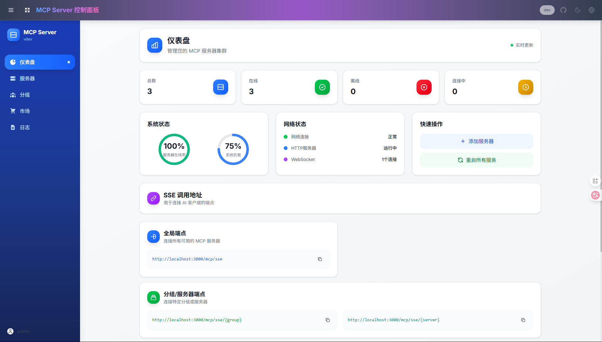

# MCP-Server：一站式 MCP 服务器聚合平台

[English Version](README.md) | 中文版

MCP-Server 通过将多个 MCP（Model Context Protocol）服务器组织为灵活的流式 HTTP（SSE）端点，简化了管理与扩展工作。系统支持按需访问全部服务器、单个服务器或按场景分组的服务器集合。


## 🚀 功能亮点

- **广泛的 MCP 服务器支持**：无缝集成任何 MCP 服务器，配置简单。
- **集中式管理控制台**：在一个简洁的 Web UI 中实时监控所有服务器的状态和性能指标。
- **灵活的协议兼容**：完全支持 stdio 和 SSE 两种 MCP 协议。
- **热插拔式配置**：在运行时动态添加、移除或更新服务器配置，无需停机。
- **基于分组的访问控制**：自定义分组并管理服务器访问权限。
- **安全认证机制**：内置用户管理，基于 JWT 和 bcrypt，实现角色权限控制。
- **Docker 就绪**：提供容器化镜像，快速部署。

## 🔧 快速开始

### 配置

通过创建 `mcp_settings.json` 自定义服务器设置：

```json
{
  "mcpServers": {
    "amap": {
      "command": "npx",
      "args": ["-y", "@amap/amap-maps-mcp-server"],
      "env": {
        "AMAP_MAPS_API_KEY": "your-api-key"
      }
    },
    "playwright": {
      "command": "npx",
      "args": ["@playwright/mcp@latest", "--headless"]
    },
    "fetch": {
      "command": "uvx",
      "args": ["mcp-server-fetch"]
    },
    "slack": {
      "command": "npx",
      "args": ["-y", "@modelcontextprotocol/server-slack"],
      "env": {
        "SLACK_BOT_TOKEN": "your-bot-token",
        "SLACK_TEAM_ID": "your-team-id"
      }
    }
  }
}
```

### Docker 部署

**推荐**：挂载自定义配置：

```bash
docker run -p 3000:3000 -v ./mcp_settings.json:/app/mcp_settings.json -v ./data:/app/data zxerai/mcp-server
```

或使用默认配置运行：

```bash
docker run -p 3000:3000 zxerai/mcp-server
```

### 访问控制台

打开 `http://localhost:3000`，使用您的账号登录。

> **提示**：默认用户名/密码为 `admin` / `admin123`。

**控制台功能**：

- 实时监控所有 MCP 服务器状态
- 启用/禁用或重新配置服务器
- 分组管理，组织服务器访问
- 用户管理，设定权限

### 支持流式的 HTTP 端点

> 截至目前，各家 AI 客户端对流式的 HTTP 端点支持不一，如果遇到问题，可以使用 SSE 端点或者等待更新。

通过以下地址连接 AI 客户端（如 Claude Desktop、Cursor、DeepChat 等）：

```
http://localhost:3000/mcp
```

这个端点为所有 MCP 服务器提供统一的流式 HTTP 接口。它允许您：

- 向任何配置的 MCP 服务器发送请求
- 实时接收响应
- 轻松与各种 AI 客户端和工具集成
- 对所有服务器使用相同的端点，简化集成过程

**智能路由（实验性功能）**：

智能路由是 MCPHub 的智能工具发现系统，使用向量语义搜索自动为任何给定任务找到最相关的工具。

```
http://localhost:3000/mcp/$smart
```

**工作原理：**

1. **工具索引**：所有 MCP 工具自动转换为向量嵌入并存储在 PostgreSQL 与 pgvector 中
2. **语义搜索**：用户查询转换为向量并使用余弦相似度与工具嵌入匹配
3. **智能筛选**：动态阈值确保相关结果且无噪声
4. **精确执行**：找到的工具可以直接执行并进行适当的参数验证

**设置要求：**



为了启用智能路由，您需要：

- 支持 pgvector 扩展的 PostgreSQL
- OpenAI API 密钥（或兼容的嵌入服务）
- 在 MCPHub 设置中启用智能路由

**基于分组的 HTTP 端点（推荐）**：

要针对特定服务器分组进行访问，请使用基于分组的 HTTP 端点：

```
http://localhost:3000/mcp/{group}
```

其中 `{group}` 是您在控制面板中创建的分组 ID 或名称。这样做可以：

- 连接到按用例组织的特定 MCP 服务器子集
- 隔离不同的 AI 工具，使其只能访问相关服务器
- 为不同环境或团队实现更精细的访问控制
- 通过分组名称轻松识别和管理服务器
- 允许不同的 AI 客户端使用相同的端点，简化集成过程

**针对特定服务器的 HTTP 端点**：
要针对特定服务器进行访问，请使用以下格式：

```
http://localhost:3000/mcp/{server}
```

其中 `{server}` 是您要连接的服务器名称。这样做可以直接访问特定的 MCP 服务器。

> **提示**：如果服务器名称和分组名称相同，则分组名称优先。

### SSE 端点集成 (未来可能废弃)

通过以下地址连接 AI 客户端（如 Claude Desktop、Cursor、DeepChat 等）：

```
http://localhost:3000/sse
```

要启用智能路由，请使用：

```
http://localhost:3000/sse/$smart
```

要针对特定服务器分组进行访问，请使用基于分组的 SSE 端点：

```
http://localhost:3000/sse/{group}
```

要针对特定服务器进行访问，请使用以下格式：

```
http://localhost:3000/sse/{server}
```

## 🧑‍💻 本地开发

```bash
git clone https://github.com/zxerai/MCP-Server.git
cd mcphub
pnpm install
pnpm dev
```

此命令将在开发模式下启动前后端，并启用热重载。

> 针对 Windows 用户，可能需要分别启动后端服务器和前端：`pnpm backend:dev`，`pnpm frontend:dev`。

## 🛠️ 常见问题

### 使用 nginx 反向代理

如果您在使用 nginx 反向代理 MCPHub，请确保在 nginx 配置中添加以下内容：

```nginx
proxy_buffering off
```

## 🔍 技术栈

- **后端**：Node.js、Express、TypeScript
- **前端**：React、Vite、Tailwind CSS
- **认证**：JWT & bcrypt
- **协议**：Model Context Protocol SDK

## 👥 贡献指南

期待您的贡献！

- 新功能与优化
- 文档完善
- Bug 报告与修复
- 翻译与建议

欢迎加入企微交流共建群，由于群人数限制，有兴趣的同学可以扫码添加管理员为好友后拉入群聊。


如果觉得项目有帮助，不妨请我喝杯咖啡 ☕️


## 致谢


## 📄 许可证

本项目采用 [Apache 2.0 许可证](LICENSE)。
