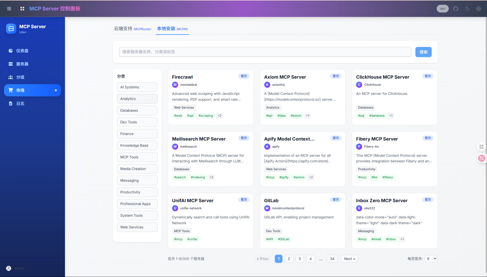

# 如何一键部署你的专属 MCP 服务

随着 MCP 逐渐成为行业事实标准，如何高效搭建和管理多个 MCP 服务已成为个人开发者面临的主要挑战。本文将介绍一种简便的解决方案，帮助您快速构建自己的 MCP 服务。

## 什么是 MCP？

模型上下文协议（Model Context Protocol，MCP）是由 Anthropic 推出的开放标准，旨在为大型语言模型（LLMs）提供标准化接口，使其能够直接连接外部数据源和工具。简言之，MCP 如同 AI 应用的 USB-C 接口，统一解决了数据孤岛和定制化集成的问题。

通过 MCP，AI 模型不仅可以实时获取最新信息，还能调用外部工具完成各类任务，实现跨平台、跨数据源的无缝交互，大幅提升 AI 应用的实用性和灵活性。

## 当下的 MCP 生态

尽管 MCP 的标准化接口为 AI 应用开发提供了便利，但在实际应用中，如何快速搭建和高效管理多个 MCP 服务仍然是一个不小的挑战。MCPHub 正是为解决这一痛点而诞生，它提供了集中管理和动态配置的解决方案，让个人开发者能够轻松应对多样化的需求，无需深入了解每个服务的具体实现细节。

## 一键部署，轻松满足个人需求

对于个人开发者而言，繁琐的部署流程常常成为创新的绊脚石。MCPHub 的最大亮点在于其"一键部署"功能：

- **极简部署**：只需一条 Docker 命令，即可在几分钟内启动完整的 MCPHub 服务，快速搭建专属 MCP 服务平台，满足个人项目或实验室环境的各种需求。

- **动态扩展**：在使用过程中，您可以随时通过 Web 仪表盘添加、移除或调整 MCP 服务器配置，无需重启整个系统。这种灵活性不仅适用于个人开发测试，也为未来功能扩展提供了无限可能。

- **标准化接口**：基于 MCP 标准，您的服务可以无缝对接各种 AI 工具，无论是 Claude Desktop、Cursor 还是其他定制化应用，都能通过统一接口调用外部数据或执行工具操作，实现真正的多源协同工作流程。

## 快速上手指南

下面，我们将以一个实例演示如何使用 MCPHub 快速搭建基于高德地图 MCP 服务的行程规划助手。

### 使用 Docker 部署

执行以下命令，即可在本地快速启动 MCPHub 服务：

```bash
docker run -p 3000:3000 samanhappy/mcphub
```

### 访问仪表盘

MCPHub 已内置多个常用 MCP 服务，如高德地图、GitHub、Slack、Fetch、Tavily、Playwright 等，开箱即可使用。在浏览器中打开 `http://localhost:3000`，直观的仪表盘将实时显示各个 MCP 服务器的状态，让您轻松管理和监控服务运行情况。



可以看到这些 MCP 服务都已成功连接并正常运行。

### 配置高德地图

由于高德地图的 MCP 服务需要 API Key，我们需要在仪表盘中进行配置。点击 amap-maps 右侧的 Edit 按钮，在弹出窗口的环境变量部分配置高德地图的 API Key。


点击保存后，MCP Hub 将自动重启高德地图的 MCP 服务，使新配置生效。

### 配置 MCP Hub SSE

MCP Hub 提供了单一聚合的 MCP Server SSE 端点：`http://localhost:3000/sse`，可在任意支持 MCP 的客户端中配置使用。这里我们选择开源的 Cherry Studio 进行演示。


配置成功后，可用工具列表中将显示所有高德 MCP 服务支持的工具功能。

### 使用高德地图 MCP 服务

现在，我们可以在 Cherry Studio 中使用高德地图的 MCP 服务了。选择智源的 Qwen2.5-7B-Instruct 模型，并确保启用 MCP Server 开关，然后输入："我明天要从南京去上海旅游，晚上想住在外滩附近，帮我规划一下交通和酒店行程"，点击发送按钮。


可以看到，Cherry Studio 在回答过程中调用了高德地图 MCP 服务的多个工具，包括坐标解析、路线规划、周边搜索等，从而实现了一个更强大的行程规划助手。

## 结语

MCPHub 的一键部署和动态配置功能，使个人开发者能够轻松搭建和管理多个 MCP 服务，极大地提升了开发效率和应用灵活性。无论是个人项目还是实验室环境，MCPHub 都能提供高效、便捷的解决方案。

随着 MCP 生态的不断扩展，我们将持续增加更多服务和功能，为开发者提供更加丰富的工具集。MCPHub 完全开源，采用 MIT 许可证，项目地址 [https://github.com/samanhappy/mcphub](https://github.com/samanhappy/mcphub)，期待您的体验与反馈，共同推动 MCP 生态的繁荣发展！