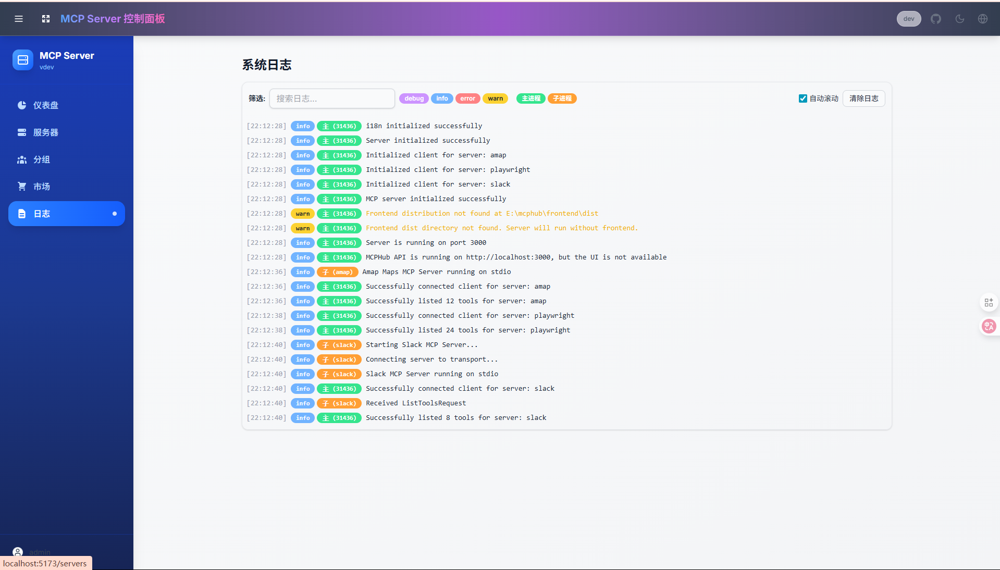
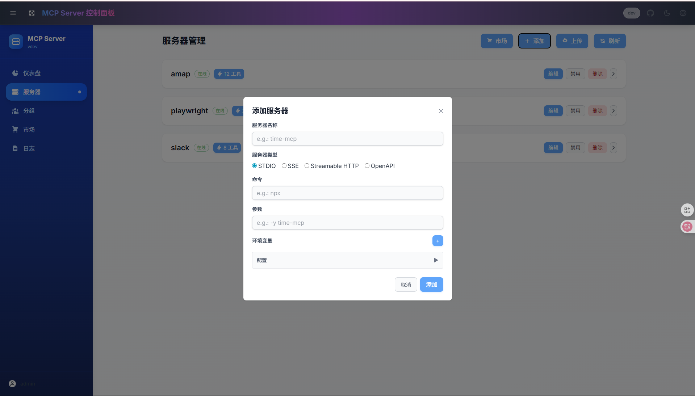
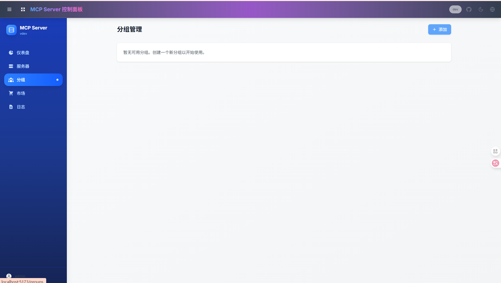

# 本地部署、一键安装、分组路由：MCPHub 重塑 MCP 服务器体验

## 概述

现代 AI 应用场景中，将大模型（LLM）与各种数据源和工具无缝对接，往往需要手动编写大量胶水代码，并且无法快速复用​。MCP（Model Context Protocol）协议由 Anthropic 在 2024 年开源，旨在提供类似“USB‑C”接口般的标准化通信方式，简化 AI 助手与内容仓库、业务系统等的集成流程​。然而，MCP 服务器部署常常需要大量环境依赖、手动配置及持续运行，开发者常因安装和配置耗费大量时间和精力​。MCPHub 作为一款开源的一站式聚合平台，通过直观的 Web UI、Docker 镜像和热插拔配置，实现本地或容器里的“一键安装”与“分组路由”，大幅降低 MCP 服务器的使用门槛和运维成本​。

## MCPHub 是什么

### MCP 协议简介

Model Context Protocol（MCP）是一种开放标准，类似“USB‑C”接口，为 AI 助手与内容仓库、业务系统和第三方服务之间提供统一通信协议。它支持 stdio 与 SSE（最新协议中被 Streamable HTTP 取代）两种通信方式，既能满足实时流式数据交换，也可用于批量任务。2024 年由 Anthropic 团队开源发布后，MCP 已在各类 AI 客户端（如 Claude Desktop）中得到应用，成功实现与 GitHub、Slack、网页自动化工具等的无缝对接。

### MCPHub 项目概览

MCPHub 是一个统一的 MCP 服务器聚合平台，内置 MCP 服务器市场实现一键安装。前端基于 React、Vite 和 Tailwind CSS 构建，后端兼容任意使用 npx 或 uvx 命令启动的 MCP 服务器。它通过一个集中式 Dashboard 实时展示各服务器的运行状态，并支持在运行时热插拔增删改服务器配置，无需停机维护。支持分组式访问控制，可以通过独立的 SSE 端点访问不同的 MCP 服务器组合，管理员可灵活定义不同团队或环境的权限策略。官方提供 Docker 镜像，仅需一条命令即可快速启动本地或云端服务。



## 为什么要使用 MCPHub

### 1. 复杂的环境依赖与配置

- MCP 服务器常依赖 Node.js、Python 等多种运行时，需手动维护大量命令、参数和环境变量。
- MCPHub 内置 MCP 服务器市场，包含众多常用 MCP 服务器，支持一键安装和自动配置，简化了环境搭建过程。
- 通过 Docker 部署，MCPHub 可在任何支持 Docker 的平台上运行，避免了环境不一致的问题。



### 2. 持续运行的服务压力

- MCP 要求长连接服务常驻内存，重启或升级时需要人工干预，缺乏弹性。
- 借助 Docker 容器化部署，MCPHub 可快速重建环境，享受容器带来的弹性与隔离优势。

### 3. 路由与分组管理缺乏统一视图

- 传统方式下，很难可视化地将不同 MCP 服务按场景分类，容易造成 token 浪费和工具选择精度下降。
- MCPHub 支持动态创建分组（如“地图检索”、“网页自动化”、“聊天”等），为每个分组生成独立的 SSE 端点，实现各类用例的隔离与优化。



## 如何使用 MCPHub

### 快速部署

```bash
docker run -p 3000:3000 samanhappy/mcphub
```

一条命令就可以在本地快速启动 MCPHub，默认监听 3000 端口。

MCPHub 使用`mcp_settings.json`保存所有服务器、分组和用户的配置。你可以创建一个 `mcp_settings.json` 文件，并将其挂载到 Docker 容器中，以便在重启时保留配置。

```json
{
  "mcpServers": {
    "amap": {
      "command": "npx",
      "args": ["-y", "@amap/amap-maps-mcp-server"],
      "env": {
        "AMAP_MAPS_API_KEY": "your-api-key"
      }
    },
    "time-mcp": {
      "command": "npx",
      "args": [
        "-y",
        "time-mcp"
      ]
    },
    "sequential-thinking": {
      "command": "npx",
      "args": [
        "-y",
        "@modelcontextprotocol/server-sequential-thinking"
      ]
    }
  }
}
```

然后挂载配置文件启动：

```bash
docker run -p 3000:3000 -v $(pwd)/mcp_settings.json:/app/mcp_settings.json samanhappy/mcphub
```

> 注意：首次运行时，MCPHub 会自动下载并安装所需的依赖包，可能需要一些时间。

### 访问控制台

启动后访问 `http://localhost:3000` 即可进入控制台。

> 默认登录用户名和密码为 `admin`/`admin123`，登录后可以修改密码以确保安全。

控制台提供了服务器管理、分组管理和市场管理等功能，你可以在这里查看所有已安装的 MCP 服务器、创建新的分组、添加或删除服务器等。

### 分组路由 & SSE 端点

#### 全局 SSE 端点

```
http://localhost:3000/sse
```

通过全局 SSE 端点可以访问所有已启用的 MCP 服务器。

#### 基于分组的 SSE 端点

除了全局 SSE 端点，MCPHub 还支持基于分组的 SSE 端点。你可以为每个分组创建独立的 SSE 端点，以便更好地管理和路由请求。
分组的 SSE 端点格式如下：

```
http://localhost:3000/sse/{groupId}
```

其中 `{groupId}` 是分组的唯一标识符，可以从控制台获取。比如我在上面的截图中创建了一个名为 `map` 的分组，选择了 `amap` 和 `sequential-thinking` 两个服务器，那么可以通过以下 URL 访问这个分组的 SSE 端点：

```
http://localhost:3000/sse/a800bef7-c4c1-4460-9557-5f4404cdd0bd
```

#### 使用分组路由

创建了路由分组后，我们就可以在任意支持 MCP 的客户端中使用这个分组的 SSE 端点了。比如在 `Cursor` 中，我们可以在配置文件中指定分组的 SSE 端点：

```json
{
  "mcpServers": {
    "mcphub": {
      "url": "http://localhost:3000/sse/a800bef7-c4c1-4460-9557-5f4404cdd0bd"
    }
  }
}
```

配置完成后，可以从 `Cursor` 中看到所有可用的 MCP 服务器工具列表。


然后，我们可以测试一下，比如输入：深度思考一下，帮我制定一个五一假期从南京出发的自驾行出游计划，要求避开拥堵路线，结合天气情况，并且可以体验到不同的自然风光。


接着可以看到，`Cursor` 在运行过程中调用了多个工具。


最终生成结果如下：

```markdown
基于对路线和天气的全面分析，我为你制定了一个四天的五一自驾游行程方案：

### 第一天（4月29日）：南京→黄山
- 出发时间：建议早上8点出发
- 行驶路线：G42沪蓉高速 → S11巢黄高速
- 行驶时间：约4.5小时（282公里）
- 住宿地点：黄山风景区附近
- 特别提醒：
  * 路线多隧道，注意安全
  * 天气较好，适合出行
  * 建议提前订好黄山景区附近酒店

### 第二天（4月30日）：黄山→婺源
- 游览时间：上午游览黄山景区
- 下午出发前往婺源
- 行驶路线：G3京台高速 → G56杭瑞高速
- 行驶时间：约2.5小时（139公里）
- 住宿地点：婺源县城或特色古村落
- 特别提醒：
  * 注意天气可能有阵雨
  * 建议游览篁岭、李坑等著名古村落

### 第三天（5月1日）：婺源→景德镇
- 上午游览婺源景点
- 中午后出发前往景德镇
- 行驶路线：G56杭瑞高速
- 行驶时间：约1.5小时（77公里）
- 住宿地点：景德镇市区
- 特别提醒：
  * 可能遇到阵雨天气
  * 建议参观陶瓷博物馆和古窑址

### 第四天（5月2日）：景德镇→南京
- 建议上午游览景德镇景点
- 中午后出发返回南京
- 行驶路线：G35济广高速 → G4211宁芜高速
- 行驶时间：约5小时（429公里）
- 特别提醒：
  * 路程较长，建议做好休息安排
  * 注意途中加油站分布
  * 建议错峰返程，避免拥堵

### 整体建议：
1. 避堵建议：
   - 选择错峰出行时间
   - 提前查看实时路况
   - 准备备选绕行路线

2. 安全建议：
   - 全程多雨，注意雨天行车安全
   - 保持车距，谨慎驾驶
   - 途经隧道较多，注意灯光使用

3. 行程准备：
   - 提前预订住宿
   - 准备雨具和应急用品
   - 建议下载离线地图
   - 检查车况，特别是雨刮和轮胎

4. 景点安排：
   - 黄山：建议游览迎客松、光明顶等
   - 婺源：篁岭、李坑、江岭等
   - 景德镇：陶瓷博物馆、古窑民俗博览区

这条路线可以让你体验到：
- 黄山的壮丽山景
- 婺源的田园风光
- 景德镇的人文历史
既避开了主要拥堵路段，又能欣赏到不同的自然风光。
```

可以看到，`Cursor` 通过调用 `amap` 和 `sequential-thinking` 两个服务器，成功生成了一个五一假期的自驾游行程方案，并且避开了拥堵路线，结合了天气情况。但是细心的同学可能发现，计划中的开始时间是 4 月 29 日，而今年的五一假期是 5 月 1 日开始的，产生偏差的原因是 `sequential-thinking` 使用了错误的假期时间。如何解决这个问题呢？我们可以尝试在分组中添加支持搜索的 MCP 服务器，这样就可以在查询时自动纠正错误的假期时间了，具体就不在这里展开了。

## 结语

MCPHub 将本地部署、一键安装、分组路由和可视化管理融为一体，以简洁而强大的设计，彻底解决了 MCP 服务器的部署、配置与运维难题。无论是追求快速验证的开发者，还是需要稳定可靠 AI 工具链的企业用户，都能通过 MCPHub 专注于核心业务与创新，而无需被底层细节所困扰。

尽管目前各家平台都在陆续推出各类 MCP 云服务，但在数据隐私、合规性和定制化需求日益增长的背景下，MCPHub 仍然是一个值得关注的本地部署解决方案​。

MCPHub 只是我一时兴起开发的小项目，没想到竟收获了这么多关注，非常感谢大家的支持！目前 MCPHub 还有不少地方需要优化和完善，我也专门建了个交流群，方便大家交流反馈。如果你也对这个项目感兴趣，欢迎一起参与建设！项目地址为：https://github.com/samanhappy/mcphub。


