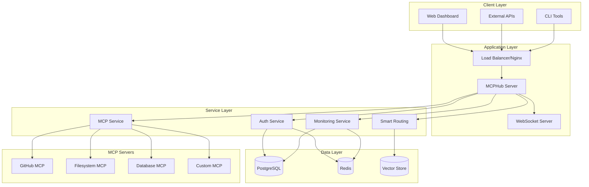
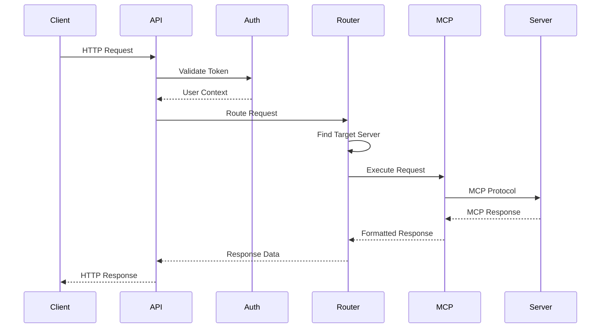

## System Overview

MCPHub is designed as a scalable, modular platform for managing Model Context Protocol (MCP) servers. The architecture follows modern web application patterns with clear separation of concerns, microservices-ready design, and extensibility in mind.

## High-Level Architecture



## Core Components

### 1. Application Server

The main Node.js/Express application that handles all HTTP requests and coordinates between services.

```typescript
// src/server.ts - Main application entry point
class MCPHubServer {
  private app: Express;
  private httpServer: Server;
  private wsServer: WebSocketServer;

  async start(): Promise<void> {
    await this.initializeDatabase();
    await this.initializeServices();
    await this.setupRoutes();
    await this.startServer();
  }
}
```

**Key Responsibilities:**

- HTTP request handling
- WebSocket connections for real-time features
- Service coordination
- Middleware chain management
- Error handling and logging

### 2. MCP Service Layer

Manages the lifecycle and communication with MCP servers.

```typescript
// src/services/mcpService.ts
class MCPService {
  private servers: Map<string, MCPServerInstance> = new Map();
  private processManager: ProcessManager;

  async startServer(config: MCPServerConfig): Promise<void> {
    const instance = await this.processManager.spawn(config);
    this.servers.set(config.name, instance);
    await this.waitForHealthy(instance);
  }

  async executeRequest(serverName: string, request: MCPRequest): Promise<MCPResponse> {
    const server = this.servers.get(serverName);
    return await server.sendRequest(request);
  }
}
```

**Key Features:**

- Process lifecycle management
- Health monitoring
- Request routing
- Error recovery
- Resource management

### 3. Smart Routing Engine

Provides AI-powered tool discovery and routing using vector embeddings.

```typescript
// src/services/smartRouting.ts
class SmartRoutingService {
  private vectorStore: VectorStore;
  private embeddingService: EmbeddingService;

  async findRelevantTools(query: string): Promise<ToolMatch[]> {
    const queryEmbedding = await this.embeddingService.embed(query);
    const matches = await this.vectorStore.similaritySearch(queryEmbedding);
    return this.rankResults(matches, query);
  }

  async indexTool(tool: ToolDefinition): Promise<void> {
    const embedding = await this.embeddingService.embed(tool.description);
    await this.vectorStore.upsert(tool.id, embedding, tool);
  }
}
```

**Components:**

- Vector embedding generation
- Similarity search
- Result ranking and filtering
- Tool metadata management

### 4. Authentication & Authorization

Handles user authentication, session management, and access control.

```typescript
// src/services/authService.ts
class AuthService {
  async authenticate(credentials: Credentials): Promise<User> {
    const user = await this.validateCredentials(credentials);
    const token = await this.generateJWT(user);
    await this.createSession(user, token);
    return user;
  }

  async authorize(user: User, resource: string, action: string): Promise<boolean> {
    const permissions = await this.getUserPermissions(user);
    return this.checkPermission(permissions, resource, action);
  }
}
```

**Features:**

- JWT-based authentication
- Role-based access control (RBAC)
- Session management
- API key authentication
- Group-based permissions

### 5. Monitoring & Logging

Provides comprehensive monitoring, metrics collection, and logging.

```typescript
// src/services/monitoringService.ts
class MonitoringService {
  private metricsCollector: MetricsCollector;
  private alertManager: AlertManager;

  async collectMetrics(): Promise<void> {
    const systemMetrics = await this.getSystemMetrics();
    const serverMetrics = await this.getMCPServerMetrics();
    await this.metricsCollector.record(systemMetrics, serverMetrics);
    await this.checkAlerts(systemMetrics, serverMetrics);
  }
}
```

**Capabilities:**

- Real-time metrics collection
- Performance monitoring
- Error tracking
- Alert management
- Audit logging

## Data Architecture

### Database Schema

```sql
-- Core entities
CREATE TABLE users (
    id UUID PRIMARY KEY,
    username VARCHAR UNIQUE NOT NULL,
    email VARCHAR UNIQUE NOT NULL,
    password_hash VARCHAR NOT NULL,
    role VARCHAR NOT NULL DEFAULT 'user',
    created_at TIMESTAMP DEFAULT NOW()
);

CREATE TABLE servers (
    id UUID PRIMARY KEY,
    name VARCHAR UNIQUE NOT NULL,
    command VARCHAR NOT NULL,
    args JSONB NOT NULL DEFAULT '[]',
    env JSONB DEFAULT '{}',
    group_name VARCHAR,
    status VARCHAR DEFAULT 'stopped',
    config JSONB DEFAULT '{}',
    created_at TIMESTAMP DEFAULT NOW(),
    updated_at TIMESTAMP DEFAULT NOW()
);

CREATE TABLE groups (
    id UUID PRIMARY KEY,
    name VARCHAR UNIQUE NOT NULL,
    description TEXT,
    config JSONB DEFAULT '{}',
    created_at TIMESTAMP DEFAULT NOW()
);

-- Vector search for smart routing
CREATE TABLE tool_embeddings (
    id UUID PRIMARY KEY,
    server_name VARCHAR NOT NULL,
    tool_name VARCHAR NOT NULL,
    description TEXT,
    embedding vector(1536),
    metadata JSONB DEFAULT '{}',
    created_at TIMESTAMP DEFAULT NOW(),
    updated_at TIMESTAMP DEFAULT NOW()
);

-- Monitoring and logging
CREATE TABLE request_logs (
    id UUID PRIMARY KEY,
    user_id UUID REFERENCES users(id),
    server_name VARCHAR NOT NULL,
    tool_name VARCHAR,
    request_data JSONB,
    response_data JSONB,
    status VARCHAR NOT NULL,
    duration_ms INTEGER,
    created_at TIMESTAMP DEFAULT NOW()
);
```

### Caching Strategy

```typescript
// src/services/cacheService.ts
class CacheService {
  // Multi-layer caching strategy
  private memoryCache: Map<string, CacheEntry> = new Map();
  private redisCache: Redis;

  async get<T>(key: string): Promise<T | null> {
    // L1: Memory cache
    const memoryEntry = this.memoryCache.get(key);
    if (memoryEntry && !this.isExpired(memoryEntry)) {
      return memoryEntry.value;
    }

    // L2: Redis cache
    const redisValue = await this.redisCache.get(key);
    if (redisValue) {
      const value = JSON.parse(redisValue);
      this.memoryCache.set(key, { value, expiry: Date.now() + 60000 });
      return value;
    }

    return null;
  }
}
```

**Cache Layers:**

- **L1 (Memory)**: Fast access for frequently used data
- **L2 (Redis)**: Shared cache across instances
- **L3 (Database)**: Persistent storage with query optimization

## Communication Patterns

### Request Flow



### WebSocket Communication

```typescript
// src/services/websocketService.ts
class WebSocketService {
  private connections: Map<string, WebSocket> = new Map();

  handleConnection(ws: WebSocket, userId: string): void {
    this.connections.set(userId, ws);

    ws.on('message', async (data) => {
      const message = JSON.parse(data.toString());
      await this.handleMessage(userId, message);
    });

    ws.on('close', () => {
      this.connections.delete(userId);
    });
  }

  broadcast(event: string, data: any): void {
    this.connections.forEach((ws) => {
      ws.send(JSON.stringify({ event, data }));
    });
  }
}
```

### Event-Driven Architecture

```typescript
// src/events/eventBus.ts
class EventBus {
  private listeners: Map<string, EventListener[]> = new Map();

  emit(event: string, data: any): void {
    const handlers = this.listeners.get(event) || [];
    handlers.forEach((handler) => handler(data));
  }

  on(event: string, handler: EventListener): void {
    const handlers = this.listeners.get(event) || [];
    handlers.push(handler);
    this.listeners.set(event, handlers);
  }
}

// Usage
eventBus.on('server.started', (data) => {
  logger.info(`Server ${data.name} started`);
  monitoringService.updateServerStatus(data.name, 'running');
});
```

## Security Architecture

### Authentication Flow


### Authorization Model

```typescript
// Role-Based Access Control (RBAC)
interface Permission {
  resource: string; // e.g., 'servers', 'groups', 'users'
  action: string; // e.g., 'create', 'read', 'update', 'delete'
  scope?: string; // e.g., 'own', 'group', 'all'
}

interface Role {
  name: string;
  permissions: Permission[];
}

const roles: Role[] = [
  {
    name: 'admin',
    permissions: [{ resource: '*', action: '*', scope: 'all' }],
  },
  {
    name: 'manager',
    permissions: [
      { resource: 'servers', action: '*', scope: 'group' },
      { resource: 'groups', action: 'read', scope: 'all' },
    ],
  },
  {
    name: 'user',
    permissions: [
      { resource: 'servers', action: 'read', scope: 'group' },
      { resource: 'tools', action: 'execute', scope: 'group' },
    ],
  },
];
```

## Scalability Considerations

### Horizontal Scaling

```yaml
# Kubernetes deployment for scaling
apiVersion: apps/v1
kind: Deployment
metadata:
  name: mcphub
spec:
  replicas: 3
  selector:
    matchLabels:
      app: mcphub
  template:
    spec:
      containers:
        - name: mcphub
          image: mcphub:latest
          resources:
            requests:
              memory: '256Mi'
              cpu: '200m'
            limits:
              memory: '512Mi'
              cpu: '500m'
```

### Load Balancing Strategy

```typescript
// src/services/loadBalancer.ts
class LoadBalancer {
  private servers: ServerInstance[] = [];
  private algorithm: 'round-robin' | 'least-connections' | 'weighted';

  selectServer(): ServerInstance {
    switch (this.algorithm) {
      case 'round-robin':
        return this.roundRobin();
      case 'least-connections':
        return this.leastConnections();
      case 'weighted':
        return this.weighted();
    }
  }
}
```

### Database Scaling

```typescript
// Database connection management
class DatabaseManager {
  private readPool: Pool; // Read replicas
  private writePool: Pool; // Primary database

  async query(sql: string, params: any[]): Promise<any> {
    if (this.isReadOperation(sql)) {
      return this.readPool.query(sql, params);
    } else {
      return this.writePool.query(sql, params);
    }
  }
}
```

## Performance Optimization

### Query Optimization

```sql
-- Optimized queries with proper indexing
CREATE INDEX CONCURRENTLY idx_servers_status_group
ON servers(status, group_name)
WHERE status IN ('running', 'starting');

CREATE INDEX CONCURRENTLY idx_tool_embeddings_similarity
ON tool_embeddings USING ivfflat (embedding vector_cosine_ops)
WITH (lists = 100);

CREATE INDEX CONCURRENTLY idx_request_logs_performance
ON request_logs(created_at, status, duration_ms)
WHERE created_at > NOW() - INTERVAL '30 days';
```

### Caching Strategy

```typescript
// Multi-level caching
class CacheManager {
  // Cache server configurations
  @Cache({ ttl: 300, key: 'server-config' })
  async getServerConfig(name: string): Promise<ServerConfig> {
    return this.database.getServerConfig(name);
  }

  // Cache tool metadata for smart routing
  @Cache({ ttl: 3600, key: 'tool-metadata' })
  async getToolMetadata(): Promise<ToolMetadata[]> {
    return this.database.getToolMetadata();
  }

  // Cache user permissions
  @Cache({ ttl: 600, key: 'user-permissions' })
  async getUserPermissions(userId: string): Promise<Permission[]> {
    return this.authService.getUserPermissions(userId);
  }
}
```

## Monitoring & Observability

### Metrics Collection

```typescript
// src/services/metricsService.ts
class MetricsService {
  private prometheus: PrometheusRegistry;

  constructor() {
    this.initializeMetrics();
  }

  private initializeMetrics(): void {
    // Request metrics
    this.requestCount = new Counter({
      name: 'mcphub_requests_total',
      help: 'Total number of requests',
      labelNames: ['method', 'route', 'status'],
    });

    // Server metrics
    this.serverStatus = new Gauge({
      name: 'mcphub_server_status',
      help: 'Status of MCP servers',
      labelNames: ['server_name', 'status'],
    });

    // Performance metrics
    this.responseTime = new Histogram({
      name: 'mcphub_response_time_seconds',
      help: 'Response time in seconds',
      labelNames: ['route'],
    });
  }
}
```

### Distributed Tracing

```typescript
// OpenTelemetry integration
import { trace } from '@opentelemetry/api';

class MCPService {
  async executeRequest(serverName: string, request: MCPRequest): Promise<MCPResponse> {
    const span = trace.getActiveSpan();
    span?.setAttributes({
      'mcp.server': serverName,
      'mcp.tool': request.tool,
      'mcp.request_id': request.id,
    });

    try {
      const response = await this.sendRequest(serverName, request);
      span?.setStatus({ code: SpanStatusCode.OK });
      return response;
    } catch (error) {
      span?.setStatus({
        code: SpanStatusCode.ERROR,
        message: error.message,
      });
      throw error;
    }
  }
}
```

## Extension Points

### Plugin Architecture

```typescript
// Plugin interface
interface MCPHubPlugin {
  name: string;
  version: string;
  init(context: PluginContext): Promise<void>;
  destroy(): Promise<void>;
}

// Plugin manager
class PluginManager {
  private plugins: Map<string, MCPHubPlugin> = new Map();

  async loadPlugin(plugin: MCPHubPlugin): Promise<void> {
    await plugin.init(this.createContext());
    this.plugins.set(plugin.name, plugin);
  }

  private createContext(): PluginContext {
    return {
      eventBus: this.eventBus,
      logger: this.logger,
      database: this.database,
      // ... other services
    };
  }
}
```

### Custom Middleware

```typescript
// Custom middleware registration
class MiddlewareManager {
  register(middleware: Middleware): void {
    this.app.use(middleware);
  }

  registerRoute(path: string, middleware: Middleware): void {
    this.app.use(path, middleware);
  }
}

// Example custom middleware
const customAuthMiddleware: Middleware = (req, res, next) => {
  // Custom authentication logic
  next();
};
```

## Deployment Architecture

### Container Strategy

```dockerfile
# Multi-stage build for optimized images
FROM node:18-alpine AS builder
WORKDIR /app
COPY package*.json ./
RUN npm ci --only=production

FROM node:18-alpine AS runtime
RUN addgroup -g 1001 -S nodejs
RUN adduser -S mcphub -u 1001
WORKDIR /app
COPY --from=builder --chown=mcphub:nodejs /app .
USER mcphub
EXPOSE 3000
CMD ["node", "dist/server.js"]
```

### Infrastructure as Code

```terraform
# Terraform configuration for AWS deployment
resource "aws_ecs_cluster" "mcphub" {
  name = "mcphub-cluster"
}

resource "aws_ecs_service" "mcphub" {
  name            = "mcphub"
  cluster         = aws_ecs_cluster.mcphub.id
  task_definition = aws_ecs_task_definition.mcphub.arn
  desired_count   = 3

  load_balancer {
    target_group_arn = aws_lb_target_group.mcphub.arn
    container_name   = "mcphub"
    container_port   = 3000
  }
}
```

This architecture provides a solid foundation for building a scalable, maintainable, and extensible MCP server management platform while following modern software development best practices.
